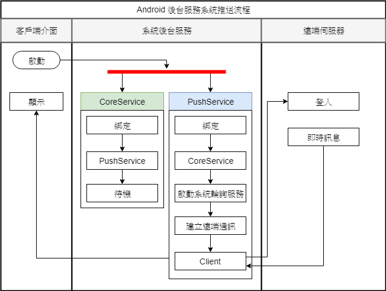

# android 及時推送服務

* Android 後台服務流程圖
    * 圖中說明使用android service元件做為移動端與遠端建立通訊接收遠端消息流程。

* 圖分為三個部分
    * 客戶端介面
        * 推送服務經由客戶端介面啟動,顯示遠端推送訊息。
    * 系統後端服務
        * 常駐兩個系統服務CoreService,PushService兩個互相綁定,當其中一方退出,由存活的另一方將重新啟動退出的服務。
    * 遠端伺服器
        * 移動端即時訊息來源